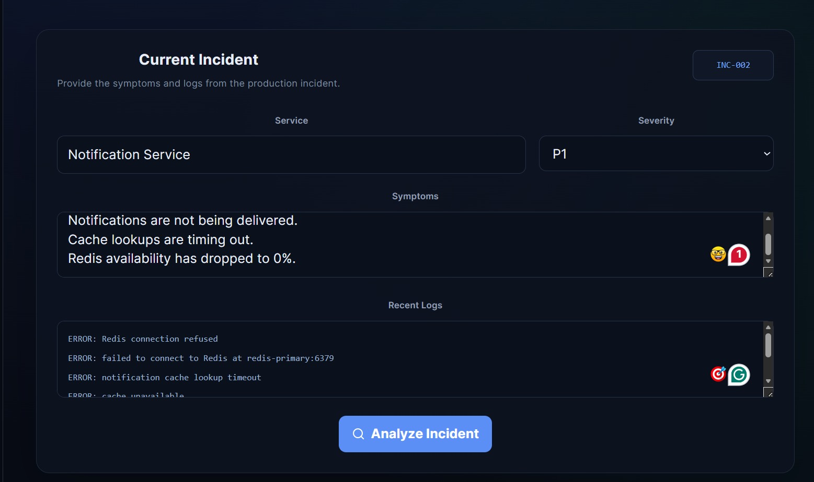
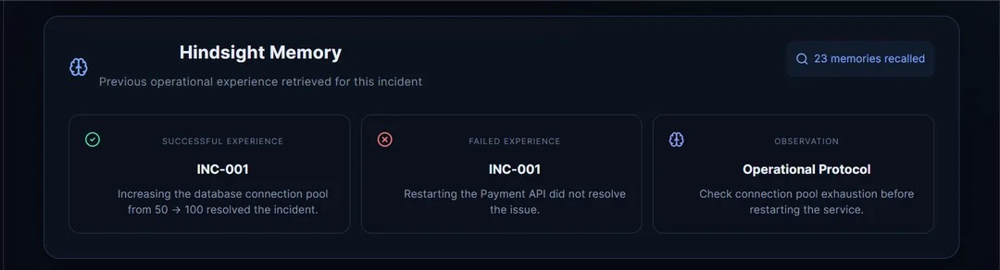
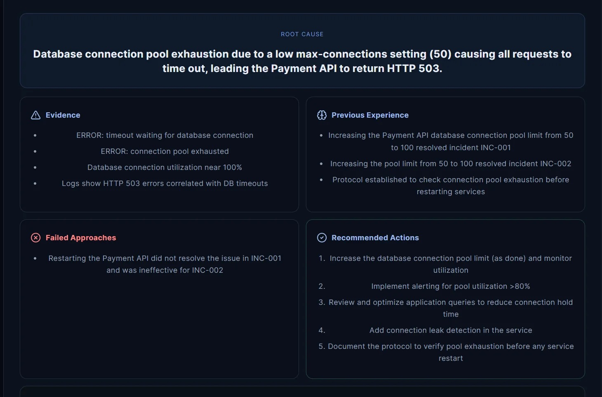

# IncidentMind 

### Memory-Powered AI Incident Response Agent

IncidentMind is an AI-powered production incident response assistant that uses **Hindsight persistent memory** to help engineers diagnose and resolve incidents using previous operational experience.

Instead of treating every incident as a completely new problem, IncidentMind remembers:

- Previous incidents
- Successful fixes
- Failed approaches
- Operational observations
- Engineer feedback
- Lessons learned

It retrieves relevant experiences from Hindsight and combines them with evidence from the current incident to produce an explainable response.

---

## Table of Contents

- [Problem](#-problem)
- [Solution](#-solution)
- [Why Hindsight?](#-why-hindsight)
- [Core Features](#-core-features)
- [Example Walkthrough](#-example-walkthrough)
- [Architecture](#️-architecture)
- [Technology Stack](#️-technology-stack)
- [Project Structure](#-project-structure)
- [Installation](#️-installation)
- [Incident Processing Flow](#-incident-processing-flow)
- [Incident Analysis Output](#-incident-analysis-output)
- [Security](#-security)
- [Testing](#-testing)
- [Development Status](#-current-development-status)
- [Team Handoff](#-team-handoff)
- [Development Principle](#-development-principle)
- [Hackathon Pitch](#-hackathon-pitch)
- [Resources](#-resources)
- [Contributor Notes](#-important-notes-for-contributors)
- [License](#-license)

---

## 🚨 Problem

Production incidents are often repetitive.

Engineering teams may have already solved a similar incident weeks or months earlier, but that knowledge can be buried in:

- Incident tickets
- Slack conversations
- Runbooks
- Postmortems
- Previous debugging sessions
- Individual engineer knowledge

A traditional AI assistant can analyze the current incident, but without persistent memory it doesn't know what the engineering team learned from previous incidents.

IncidentMind addresses this by giving the incident-response agent a **persistent operational memory layer using Hindsight**.

---

## 💡 Solution

IncidentMind creates a continuous incident-learning loop:

```
Current Incident (logs, symptoms, service, severity)
        │
        ▼
Hindsight Recall (previous incidents, fixes, failures, observations)
        │
        ▼
AI Reasoning (current evidence + previous experience)
        │
        ▼
Incident Analysis (root cause, evidence, recommendations,
                    uncertainty, confidence)
        │
        ▼
Engineer Resolution
        │
        ▼
Hindsight Retain (what worked, what failed, lessons learned)
        │
        ▼
Future Incidents
```

The core loop, simplified:

```
Incident → Recall previous experience → Analyze current evidence
        → Recommend action → Engineer resolves incident
        → Store new experience → Future incidents become easier
```

---

## 🧠 Why Hindsight?

Hindsight is the persistent memory layer of IncidentMind.

The system uses Hindsight to:

```
RETAIN → REMEMBER → RECALL → REASON → LEARN
```

The LLM performs reasoning, while Hindsight provides long-term operational memory. This moves the system beyond a simple:

```
User → LLM → Answer
```

architecture, and instead follows:

```
User → IncidentMind → Hindsight Recall
     → Current Evidence + Previous Experience → LLM Reasoning
     → Incident Analysis → Engineer Feedback → Hindsight Retain
```

---

## ✨ Core Features

### 1. Incident Analysis

Engineers can submit production incidents containing information such as:

- Incident ID
- Service
- Severity
- Symptoms
- Logs
- Observations

IncidentMind analyzes the incident and generates a structured response.

### 2. Persistent Memory

Previous incidents are stored as operational memories. The system remembers:

- What happened
- What engineers tried
- What worked
- What failed
- What the final resolution was
- Important observations

### 3. Memory Recall

When a new incident occurs, IncidentMind searches for relevant previous experiences.

**Example** — current incident:

```
Payment API
HTTP 503
Database timeout
Connection pool exhausted
```

Recalled previous incident:

```
Payment API
HTTP 503
Database connection pool exhausted

Successful Fix: Increase connection pool size
```

### 4. Successful and Failed Approaches

IncidentMind remembers failed approaches, not just successful ones — so engineers don't waste time repeating them.

```
Attempt 1: Restart Payment API           → Failed
Attempt 2: Increase database connection  → Successful
           pool
```

### 5. Explainable Recommendations

Instead of just saying "increase the database connection pool," IncidentMind explains its reasoning:

```
Root Cause:
Database connection pool exhaustion.

Evidence:
- Connection pool is exhausted.
- Database requests are timing out.
- HTTP 503 responses are increasing.

Previous Experience:
A similar incident was previously resolved by increasing
the database connection pool.

Recommendation:
Increase the connection pool after validating current
database capacity.
```

### 6. Confidence and Uncertainty

IncidentMind distinguishes between **high**, **medium**, and **low** confidence, and flags uncertainty when available evidence is insufficient — so recommendations are never presented as guaranteed solutions.

### 7. Resolution Learning

After an engineer resolves an incident, the resolution is stored back into Hindsight, closing the feedback loop:

```
Incident → Recommendation → Engineer Action → Resolution
        → Memory → Future Recommendation
```

---

## 🧪 Example Walkthrough

### INC-001 — First Incident

The Payment API experiences:

```
HTTP 503 errors
Database request timeouts
Database connection pool exhaustion
```

**Attempt 1:** Restart Payment API → **FAILED**
**Attempt 2:** Increase database connection pool (50 → 100) → **SUCCESS**

IncidentMind stores this experience.

### INC-002 — Memory-Assisted Incident

A new incident occurs with the same symptoms:

```
Payment API
HTTP 503
Database timeouts
Connection pool exhausted
```

IncidentMind recalls **INC-001** and identifies:

- **Successful approach:** Increase database connection pool
- **Failed approach:** Restarting the Payment API

The AI combines this historical information with current evidence to produce a recommendation.

### INC-003 — Important Demonstration

INC-003 demonstrates that IncidentMind does **not blindly copy historical solutions**.

New incident:

```
Payment API
HTTP 503

Database utilization: 35%
Redis: Connection refused
Cache: Unavailable
```

The system recalls the previous database incident because the symptoms look similar — but the current evidence does **not** support database connection pool exhaustion. Instead:

```
Current Evidence → Redis connection refused → Cache unavailable
                 → Investigate Redis dependency
```






This demonstrates the key idea:

> **Previous Experience + Current Evidence = Context-Aware Decision**
> (not: Previous Experience = Automatic Recommendation)

---

## 🏗️ Architecture

```
                    React UI
        (Incident Input, Analysis Dashboard,
                Memory Display)
                      │
                      │ HTTP
                      ▼
                  FastAPI API
      (Incident / Analysis / Resolution Endpoints)
                      │
        ┌─────────────┴─────────────┐
        ▼                           ▼
   Hindsight                      Groq
(Recall memories,           (LLM reasoning,
 Retain memories)            Incident analysis)
        │                           │
        └─────────────┬─────────────┘
                       ▼
              Incident Analysis
    (Root Cause, Evidence, Previous Experience,
     Failed Approaches, Recommendations,
     Uncertainty, Confidence)
                       │
                       ▼
              Engineer Resolution
                       │
                       ▼
               Hindsight Retain
  (New Experience, Resolution, Lessons Learned)
```

---

## 🛠️ Technology Stack

| Layer | Technologies |
|---|---|
| **Frontend** | React, Vite, JavaScript, CSS, Lucide React |
| **Backend** | Python, FastAPI, Pydantic |
| **AI** | Groq (`openai/gpt-oss-120b`) |
| **Memory** | Hindsight |
| **Development** | Git, GitHub, VS Code |

---

## 📁 Project Structure

```
IncidentMind/
│
├── backend/
│   ├── main.py
│   ├── incident_agent.py
│   ├── llm_service.py
│   ├── hindsight_service.py
│   ├── test_agent.py
│   ├── test_hindsight.py
│   ├── requirements.txt
│   ├── .env.example
│   └── .env
│
├── frontend/
│   ├── src/
│   │   ├── App.jsx
│   │   ├── App.css
│   │   └── ...
│   ├── package.json
│   └── vite.config.js
│
├── .gitignore
└── README.md
```

> ⚠️ `.env` should remain local and must never be committed to GitHub.

---

## ⚙️ Installation

### Prerequisites

- Python 3.11+
- Node.js
- npm
- Git
- Hindsight access
- Groq API key

### 1. Clone the Repository

```bash
git clone https://github.com/chandanboyina/IncidentMind.git
cd IncidentMind
```

### 2. Backend Setup

```bash
cd backend
python -m venv venv
```

Activate the virtual environment (Windows):

```powershell
.\venv\Scripts\Activate.ps1
```

Install dependencies:

```bash
pip install -r requirements.txt
```

### 3. Environment Variables

Create `backend/.env` and add the required credentials:

```env
GROQ_API_KEY=your_groq_api_key
HINDSIGHT_API_URL=your_hindsight_url
HINDSIGHT_API_KEY=your_hindsight_api_key
```

Never commit this file. Use `.env.example` as the template.

### 4. Start the Backend

From `IncidentMind/backend`:

```bash
uvicorn main:app --reload
```

- Backend: `http://127.0.0.1:8000`
- Swagger docs: `http://127.0.0.1:8000/docs`

### 5. Frontend Setup

Open a second terminal:

```bash
cd frontend
npm install
npm run dev
```

Frontend: `http://localhost:5173`

---

## 🔄 Incident Processing Flow

1. Receive incident
2. Extract incident information
3. Recall relevant Hindsight memories
4. Combine memory + current evidence
5. Send context to LLM
6. Generate structured analysis
7. Display result
8. Engineer resolves incident
9. Store resolution in Hindsight

---

## 📊 Incident Analysis Output

The analysis includes:

- Root Cause
- Evidence
- Previous Experience
- Successful Approaches
- Failed Approaches
- Recommended Actions
- Uncertainty
- Confidence

**Example:**

```
Root Cause:
Database connection pool exhaustion

Evidence:
- Database requests are timing out
- Connection pool is exhausted
- HTTP 503 errors are increasing

Previous Experience:
Similar incident INC-001 was resolved by
increasing the database connection pool.

Failed Approach:
Restarting the Payment API did not resolve
the previous incident.

Recommended Action:
Investigate current connection utilization and
increase the pool size if database capacity allows.

Confidence: High
```

---

## 🔐 Security

Never commit secrets to GitHub. The following must remain private:

- `.env`
- API keys
- Hindsight credentials
- Groq credentials
- Access tokens
- Passwords
- Private keys

The `.gitignore` file should prevent accidental commits. Use `.env.example` for documenting required environment variables.

---

## 🧪 Testing

Run all backend tests:

```bash
pytest
```

Run a specific test file:

```bash
pytest test_agent.py
pytest test_hindsight.py
```

---

## 🚧 Current Development Status

### Completed

- [x] FastAPI backend
- [x] React frontend
- [x] Hindsight integration
- [x] Hindsight memory recall
- [x] Hindsight memory retention
- [x] Groq LLM integration
- [x] Incident analysis
- [x] Structured AI response
- [x] Previous incident experience
- [x] Successful approach tracking
- [x] Failed approach tracking
- [x] Resolution learning
- [x] Memory display in UI

### Next Tasks

- [ ] Implement and demonstrate INC-003
- [ ] Improve different-root-cause detection
- [ ] Improve memory visualization
- [ ] Improve error handling
- [ ] Add more incident scenarios
- [ ] Add automated tests
- [ ] Clean demo memory dataset
- [ ] Improve UI polish
- [ ] Prepare final hackathon demo
- [ ] Prepare demo video
- [ ] Finalize submission documentation

---

## 👥 Team Handoff

If another developer is continuing this project:

**Step 1 — Clone**
```bash
git clone https://github.com/chandanboyina/IncidentMind.git
cd IncidentMind
```

**Step 2 — Setup Backend**
```bash
cd backend
python -m venv venv
```
Windows:
```powershell
.\venv\Scripts\Activate.ps1
```
```bash
pip install -r requirements.txt
```

**Step 3 — Configure Environment**
Create `backend/.env` and add the required API credentials.

**Step 4 — Start Backend**
```bash
uvicorn main:app --reload
```

**Step 5 — Start Frontend**
```bash
cd frontend
npm install
npm run dev
```

**Step 6 — Test Existing Flow**
Open `http://localhost:5173` and first understand the existing incident analysis and Hindsight memory flow. Do not immediately restructure the application.

**Step 7 — Work on INC-003**
The next important task is to demonstrate that IncidentMind can distinguish between **similar symptoms** and a **different root cause**. The agent should use historical memory as supporting evidence rather than blindly copying the previous solution.

---

## 🎯 Development Principle

> **Memory should influence reasoning, not replace reasoning.**

A previous incident should be treated as evidence — it should not automatically become the answer. The agent must compare:

```
Historical Experience + Current Incident Evidence
    + Current System State
    → Context-Aware Recommendation
```

---

## 🏆 Hackathon Pitch

**One-line pitch:**
> IncidentMind gives AI incident responders a persistent memory of what the engineering team has already learned.

**The core idea:**

Every resolved incident becomes experience. Every failed approach becomes a lesson. Every future incident can benefit from previous operational knowledge.

```
Past Incidents → Persistent Memory → Current Incident
    → AI Reasoning → Better Decision → New Learning
    → Future Incidents
```

---

## 🔗 Resources

- **Hindsight docs:** https://hindsight.vectorize.io/
- **Hindsight GitHub:** https://github.com/vectorize-io/hindsight
- **Hindsight Cloud:** https://ui.hindsight.vectorize.io/
- **FastAPI:** https://fastapi.tiangolo.com/
- **React:** https://react.dev/
- **Groq:** https://groq.com/

---

## 📌 Important Notes for Contributors

1. Do not commit `.env`.
2. Do not expose API keys.
3. Do not delete the existing Hindsight integration without understanding the current flow.
4. Test backend and frontend before making major changes.
5. Keep the incident-memory workflow intact.
6. Prefer small, focused changes.
7. Test each change locally.
8. Update this README when the architecture or setup changes.
9. Use meaningful Git commit messages.
10. Create a separate branch for major features.

**Recommended workflow:**

```bash
git checkout -b feature/inc-003
git add .
git commit -m "feat: add different root cause incident scenario"
git push -u origin feature/inc-003
```

---


